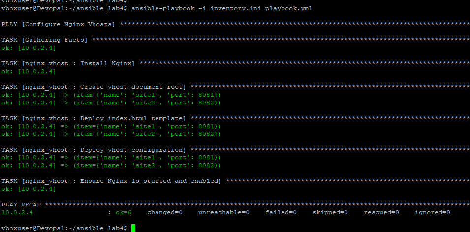
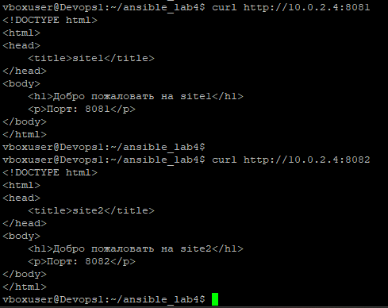
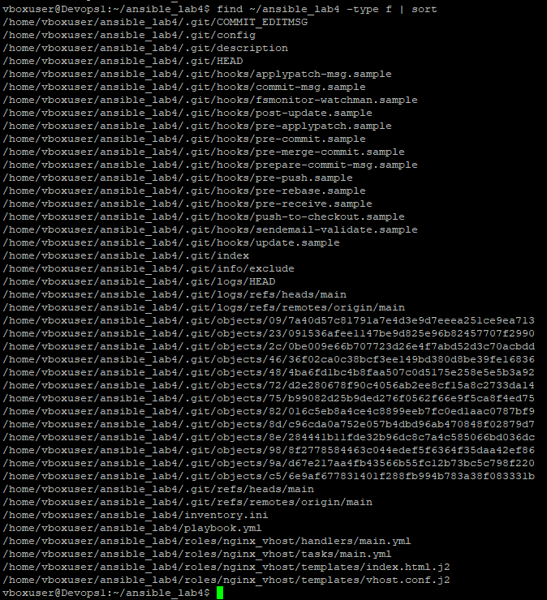

# Лабораторная работа 4. Ansible Roles

## Задача
Создать плейбук и роль Nginx Vhost. Роль должна устанавливать на целевой хост nginx и активировать vhost с заданным именем. Для vhost использовать j2 шаблон индексного файла и конфига. Родительский плейбук должен вызывать роль и список vhost передавать через переменную уровня плей в цикле.

## Структура проекта
- `playbook.yml` - родительский плейбук с переменной `vhosts`
- `inventory.ini` - инвентарь с целевым хостом
- `roles/nginx_vhost/` - директория роли
  - `tasks/main.yml` - задачи роли (установка nginx, создание директорий, деплой шаблонов)
  - `templates/index.html.j2` - шаблон Jinja2 для индексной страницы
  - `templates/vhost.conf.j2` - шаблон Jinja2 для конфига nginx
  - `handlers/main.yml` - обработчик перезапуска nginx

## Как запустить
```bash
ansible-playbook -i inventory.ini playbook.yml
```

## Результат
На целевом хосте 10.0.2.4 установлен Nginx, созданы два виртуальных хоста (site1 на порту 8081 и site2 на порту 8082). Для каждого хоста сгенерированы конфигурационные файлы и индексные страницы из j2 шаблонов.

## Проверка
```bash
curl http://10.0.2.4:8081
curl http://10.0.2.4:8082
```

## Скриншоты работы
### Запуск плейбука

### Проверка curl

### Структура

